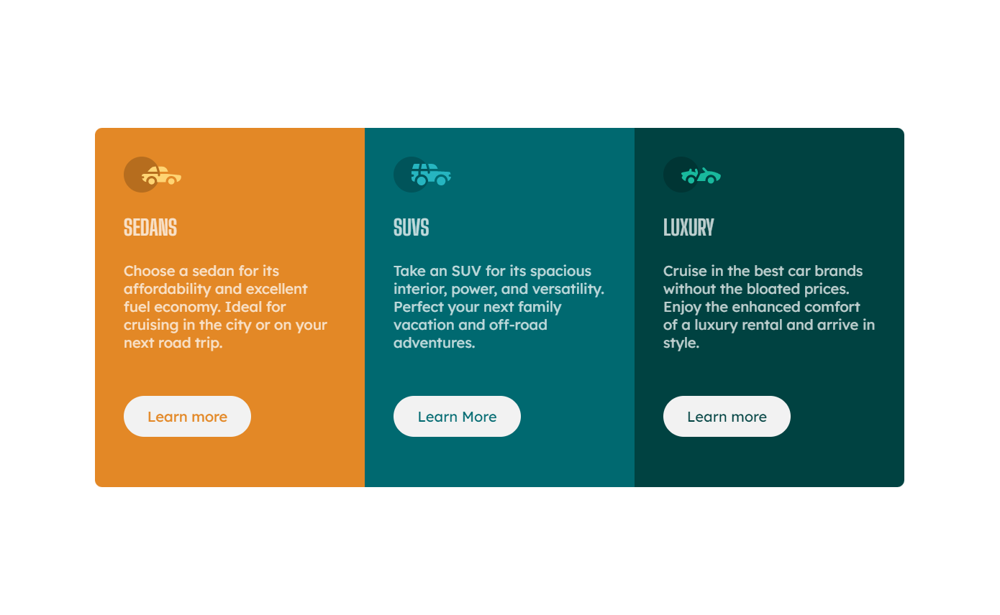
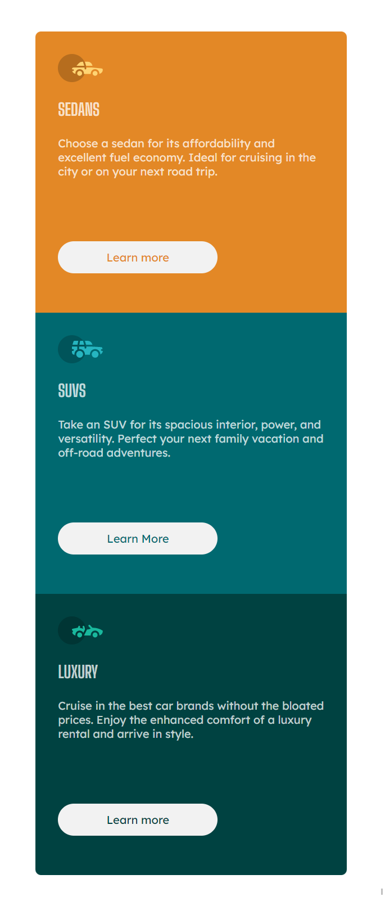

# Frontend Mentor - 3-column preview card component solution

This is a solution to the [3-column preview card component challenge on Frontend Mentor](https://www.frontendmentor.io/challenges/3column-preview-card-component-pH92eAR2-). Frontend Mentor challenges help you improve your coding skills by building realistic projects.

## Table of contents

- [Overview](#overview)
  - [The challenge](#the-challenge)
  - [Screenshot](#screenshot)
  - [Links](#links)
- [My process](#my-process)
  - [Built with](#built-with)
  - [What I learned](#what-i-learned)
  - [Continued development](#continued-development)
  - [Useful resources](#useful-resources)
- [Author](#author)
- [Acknowledgments](#acknowledgments)

**Note: Delete this note and update the table of contents based on what sections you keep.**

## Overview

### The challenge

Users should be able to:

- View the optimal layout depending on their device's screen size
- See hover states for interactive elements

### Screenshot




### Links

- Solution URL: [Add solution URL here](https://your-solution-url.com)
- Live Site URL: [Add live site URL here](https://your-live-site-url.com)

## My process

### Built with

- Semantic HTML5 markup
- CSS custom properties
- Flexbox

### What I learned

- use css variable

```css
:root {
  --brightOrange: hsl(31, 77%, 52%);
  --darkCyan: hsl(184, 100%, 22%);
  --veryDarkCyan: hsl(179, 100%, 13%);
  --white: hsl(0, 0%, 100%, 0.75);
  --lightGray: hsl(0, 0%, 95%);
}
```

- import google font

```css
@import url("https://fonts.googleapis.com/css2?family=Lexend+Deca&display=swap");
@import url("https://fonts.googleapis.com/css2?family=Big+Shoulders+Display:wght@700&display=swap");
```

- use medium query to adopt different screen size

```css
@media screen and (max-width: 900px) {
  .cars {
    flex-direction: column;
    width: 60%;
  }
  .car {
    width: 100%;
    height: 400px;
  }
  .car:nth-child(1) {
    border-bottom-left-radius: 0;
    border-top-right-radius: 0.5rem;
    margin-top: 3rem;
  }
  .car:nth-child(3) {
    border-top-right-radius: 0;
    border-bottom-left-radius: 0.5rem;
    margin-bottom: 3rem;
  }
}

@media screen and (max-width: 668px) {
  .cars {
    width: 80%;
  }
}
```

- use nth-child() pseudo-classes to choose first and last card.

### Continued development

the medium queries are not perfect.
