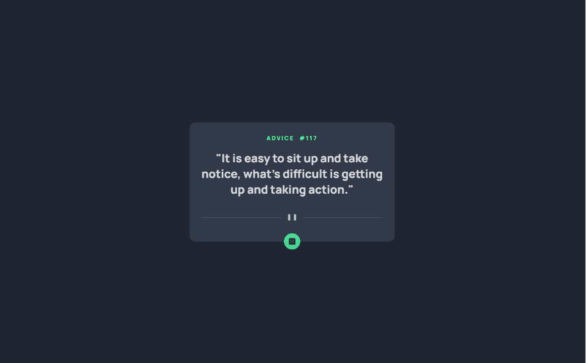
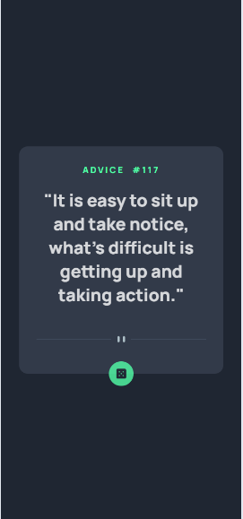

# Frontend Mentor - Advice generator app solution

This is a solution to the [Advice generator app challenge on Frontend Mentor](https://www.frontendmentor.io/challenges/advice-generator-app-QdUG-13db). Frontend Mentor challenges help you improve your coding skills by building realistic projects.

## Table of contents

- [Overview](#overview)
  - [The challenge](#the-challenge)
  - [Screenshot](#screenshot)
  - [Links](#links)
- [My process](#my-process)
  - [Built with](#built-with)
  - [What I learned](#what-i-learned)
  - [Continued development](#continued-development)
  - [Useful resources](#useful-resources)
- [Author](#author)
- [Acknowledgments](#acknowledgments)

**Note: Delete this note and update the table of contents based on what sections you keep.**

## Overview

### The challenge

Users should be able to:

- View the optimal layout for the app depending on their device's screen size
- See hover states for all interactive elements on the page
- Generate a new piece of advice by clicking the dice icon

### Screenshot




### Links

- Solution URL: [Add solution URL here](https://your-solution-url.com)
- Live Site URL: [Add live site URL here](https://your-live-site-url.com)

## My process

### Built with

- Semantic HTML5 markup
- CSS custom properties
- Flexbox
- JS

### What I learned

- use `Math.random` to choose advice

```js
const advice = {
  117: "It is easy to sit up and take notice, what's difficult is getting  up and \
    take action.",
  118: "Break your action steps into smaller, more manageable tasks.",
  119: "Find ways to stay motivated throughout the process. ",
  120: "Acknowledging and celebrating your progress, no matter how small, can boost your morale and motivate you to keep going.",
};

function randomAdvice() {
  const keys = Object.keys(advice);
  const random_idx = Math.floor(Math.random() * keys.length);
  const id = keys[random_idx];
  return [id, advice[id]];
}
```

### Continued development

### Useful resources

## Author

- Frontend Mentor - [@perterhuan](https://www.frontendmentor.io/profile/perterhuan)

## Acknowledgments
