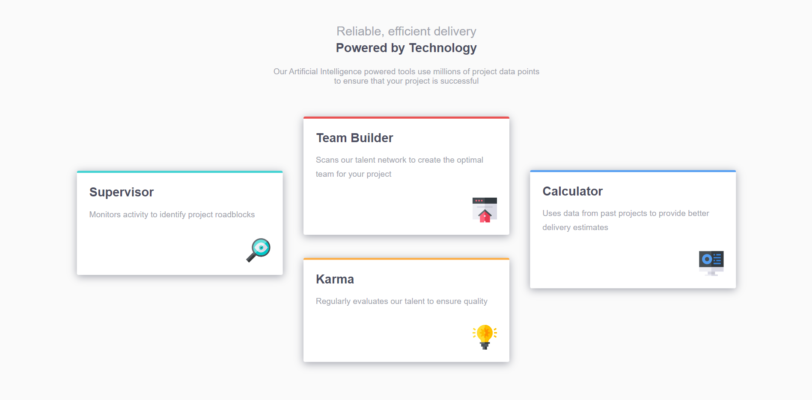

# Frontend Mentor - Four card feature section solution

This is a solution to the [Four card feature section challenge on Frontend Mentor](https://www.frontendmentor.io/challenges/four-card-feature-section-weK1eFYK). Frontend Mentor challenges help you improve your coding skills by building realistic projects.

## Table of contents

- [Overview](#overview)
  - [The challenge](#the-challenge)
  - [Screenshot](#screenshot)
  - [Links](#links)
- [My process](#my-process)
  - [Built with](#built-with)
  - [What I learned](#what-i-learned)
  - [Continued development](#continued-development)
  - [Useful resources](#useful-resources)
- [Author](#author)
- [Acknowledgments](#acknowledgments)

**Note: Delete this note and update the table of contents based on what sections you keep.**

## Overview

### The challenge

Users should be able to:

- View the optimal layout for the site depending on their device's screen size

### Screenshot




### Links

- Solution URL: [Add solution URL here](https://your-solution-url.com)
- Live Site URL: [Add live site URL here](https://your-live-site-url.com)

## My process

### Built with

- Semantic HTML5 markup
- CSS custom properties
- Flexbox

### What I learned

- use `transform` to layout four card

```
section:nth-child(1) {
  border-top-color: var(--clr-cyan);
  transform: translate(-110%, 50%);
}
section:nth-child(2) {
  border-top-color: var(--clr-red);
  transform: translate(0, -90%);
}
section:nth-child(3) {
  border-top-color: var(--clr-orange);
  transform: translate(0, -80%);
}
section:nth-child(4) {
  border-top-color: var(--clr-blue);
  transform: translate(110%, -233%);
}
```

### Continued development

### Useful resources

## Author

- Frontend Mentor - [@perterhuan](https://www.frontendmentor.io/profile/perterhuan)

## Acknowledgments
