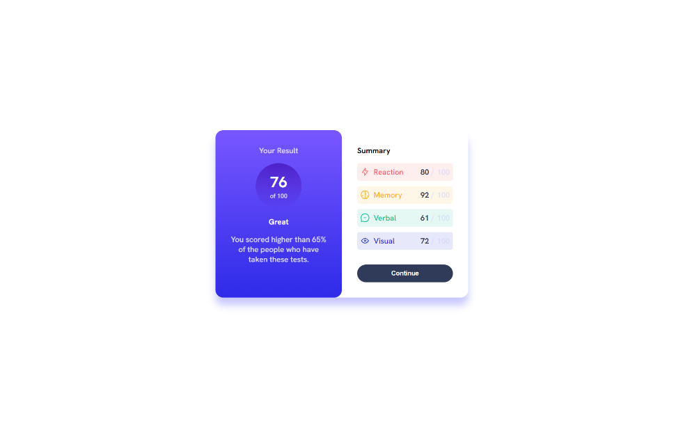

# Frontend Mentor - Results summary component solution

This is a solution to the [Results summary component challenge on Frontend Mentor](https://www.frontendmentor.io/challenges/results-summary-component-CE_K6s0maV). Frontend Mentor challenges help you improve your coding skills by building realistic projects.

## Table of contents

- [Overview](#overview)
  - [The challenge](#the-challenge)
  - [Screenshot](#screenshot)
  - [Links](#links)
- [My process](#my-process)
  - [Built with](#built-with)
  - [What I learned](#what-i-learned)
  - [Continued development](#continued-development)
  - [Useful resources](#useful-resources)
- [Author](#author)
- [Acknowledgments](#acknowledgments)

## Overview

### The challenge

Users should be able to:

- View the optimal layout for the interface depending on their device's screen size
- See hover and focus states for all interactive elements on the page
- **Bonus**: Use the local JSON data to dynamically populate the content

### Screenshot




### Links

- Solution URL: [Add solution URL here](https://your-solution-url.com)
- Live Site URL: [Add live site URL here](https://your-live-site-url.com)

## My process

### Built with

- Semantic HTML5 markup
- CSS custom properties
- Flexbox
- JS

### What I learned

- use `Fetch` to get json data and generate html

```js
const score_details = document.querySelector(".score_details");

async function generateElem() {
  const response = await fetch("./data.json");
  if (response.ok) {
    let json = await response.json();

    const info = [];
    json.forEach((d) => {
      info.push(`
        <div class="${d.category} category">
            <span class="name">
                
                ${d.category}
            </span>
            <span class="content">
                <span class="score_value">${d.score}</span>
                <span class="other"> / 100</span>
                </span>
        </div>

        `);
    });

    score_details.innerHTML = info.join("");
  }
}
generateElem();
```

### Continued development

### Useful resources

- [Fetch](https://javascript.info/fetch) A tutorial for Javascript Fetch

## Author

- Frontend Mentor - [@perterhuan](https://www.frontendmentor.io/profile/perterhuan)

## Acknowledgments
